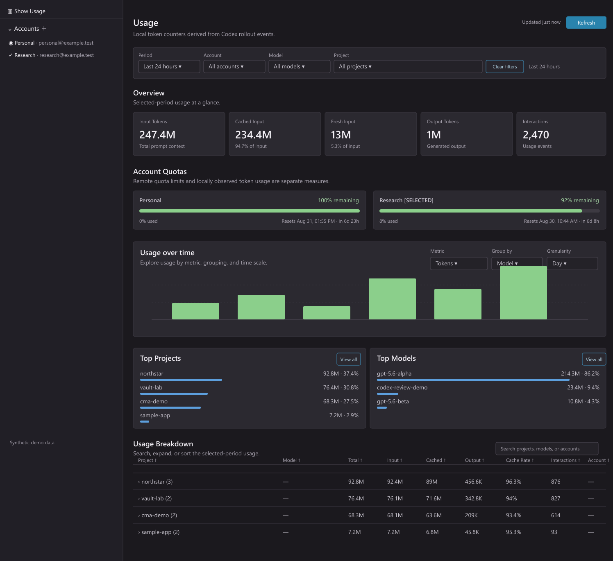

# Codex Multi Account

<p align="center">
  
</p>

<p align="center">
  <a href="https://github.com/VBenevides/codex-multi-account/releases/latest"></a>
  <a href="LICENSE"></a>
  <a href="https://github.com/VBenevides/codex-multi-account/actions/workflows/codeql.yml"></a>
  <a href="https://github.com/VBenevides/codex-multi-account/actions/workflows/security.yml"></a>
</p>

## Switch Codex accounts without rebuilding your setup

Codex Multi Account (CMA) is a companion VS Code extension for people who use
more than one Codex account. Keep separate local profiles, switch the active
account from the Accounts view, and continue using the native Codex extension
with the same configuration, MCP settings, sessions, and skills.

CMA does not replace Codex chat or model execution. It keeps account
management and local usage visibility in one small workspace tool.

<p align="center">
  
</p>

*The Usage image shows mocked data only.*

## Why CMA

- **Switch accounts safely.** Sign in profiles once, then use **Select Account**
  to atomically replace the auth file used by Codex. Shared `config.toml`, MCP
  settings, sessions, and skills stay in place.
- **Keep work and personal contexts separate.** Store one profile per account
  under `~/.codex/cma/accounts` without duplicating the rest of your Codex home.
- **See where usage goes.** Review input, cached, fresh, and output tokens by
  account, model, project, and period in the local Usage dashboard.
- **Recover with confidence.** Use diagnostics, account health, repair, backup,
  and rebuild commands when local state needs attention.
- **Stay in control of network access.** Quota checks are disabled by default;
  enable them only when you want CMA to query the selected or all profiles.

## Account switching

1. Enable `CMA: Enable File-backed Auth` in VS Code settings.
2. Use **CMA: Add Account** and **CMA: Sign In** for each profile. The native
   Codex CLI remains responsible for the browser or device login.
3. Select a signed-in profile from the Accounts view. CMA stages authentication
   privately and performs a safe atomic replacement of `~/.codex/auth.json`.
4. If the native extension still shows the old account, run **Developer: Reload
   Window**.

Sign-out removes stored credentials while retaining safe profile metadata when
possible, so the account list and historical usage remain useful.

## Usage dashboard

The Usage view starts with the last 30 days and supports filters for period,
account, model, and project. It includes:

- overview totals for input, cached input, fresh input, output, and interactions;
- optional quota windows with remaining percentages and reset times;
- daily charts grouped by model, project, or account;
- searchable, expandable, sortable usage breakdowns;
- token-only CSV and JSON exports.

Usage totals are local observations from Codex rollout events. They do not
represent ChatGPT subscription quota, billing, or server-side rate-limit
accounting.

## Local-first security

Authentication files are password-equivalent secrets. CMA stores profiles under
`~/.codex/cma/accounts`, never logs credentials, and does not store them in
SQLite or a webview. Usage storage contains token counts, timestamps, rollout
identifiers, and safe account metadata—not rollout conversation content.

Quota requests are opt-in. When enabled, CMA sends access tokens only to
`https://chatgpt.com/backend-api/wham/usage`. Never commit a real `auth.json`;
use synthetic fixtures for development and documentation.

## Troubleshooting

- Use **CMA: Diagnostics** for redacted environment and database health details.
- Use **CMA: Repair Selected Profile State** when the live account and selected
  profile disagree.
- Use **CMA: Rebuild Usage Database** only after making a backup; it removes the
  local usage database and rebuilds it from rollout files.
- Use **CMA: Re-authenticate Broken Profile** when a saved profile needs a new
  native Codex login.

## Remote and WSL

Install CMA in the same VS Code extension host as the native Codex extension.
CMA uses that host's `os.homedir()`, so a remote or WSL host reads its own
`~/.codex` directory. Browser or device login still opens on the client
according to VS Code's remote environment.

## Uninstall

Uninstalling CMA does not remove `~/.codex/cma` or native Codex files. Back up
any profiles or usage history you want to keep, sign out profiles, then remove
the CMA directory if needed.

## Development

Version 0.1.0 targets VS Code 1.102 or newer.

```sh
npm install
npm run check
npm run build
npm run package
# Build and install the current VSIX in VS Code
./dev-install.sh
```
